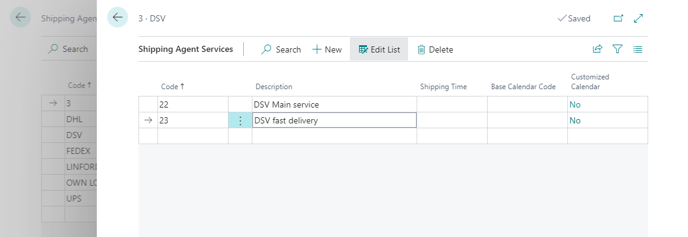
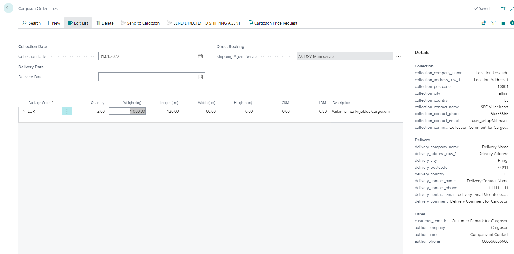

# Cargoson Interface for Business Central User Guide

Cargoson Interface enables the following:
- Sending transportation orders (incl. Direct Booking ones) from Business Central to Cargoson. Sending transportation orders is supported from Business Central Sales Quotes, Sales Orders, Posted Sales Shipments and Purchase orders.  
- Sending transportation price requests from Business Central to Cargoson and applying the selection directly to the documents. Sending price requests is supported from Business Central Sales Quotes, Sales Orders, Posted Sales Shipments and Purchase orders.
- See data exchange log between Business Central and Cargoson.

## Contents
- [Cargoson App Installation](#Cargoson-app-installation)
- [Menu](#menu) 
- [How to setup](#how-to-setup) 
  - [Setup API ](#setup-api)
  - [Setup Package Types](#setup-package-types) 
  - [Setup User for Cargoson](#setup-user-for-cargoson)
  - [Setup Shipping Agents and Shipping Agent Services for Cargoson](#setup-shipping-agents-and-shipping-agent-services-for-cargoson) 
- [How to make price requests from Cargoson](#how-to-make-price-requests-from-cargoson)
- [How to send transportation orders to Cargoson](#how-to-send-transportation-orders-to-cargoson)  
- [How to check Cargoson Log entries](#how-to-check-cargoson-log-entries)

     

## Cargoson App Installation
Open **Extension Management** and check if extension named ‘Cargoson’ is installed. If not, please find and install it from AppSource or contact BCS Itera AS.

## Menu
Cargoson menu items can be found from all Business Central Role centers via search functionality. Actions can be run from related pages (see instrctions below). 

## How to setup

### Setup API

Search for **Cargoson Setup** to open the Cargoson Setup page and fill the fields as following (mandatory fields marked with *):

|Field|Description|
|---|---|
|Service URL*|Cargoson Service URL given by Cargoson support.|  
|Authentication Phrase*|Cargoson Authentication Phrase given by Cargoson support.| 
|Default Line Description*|Specifies Cargoson transportation order default line description.|
|Default Package Code*|Specifies Cargoson transportation order line default Package Type.|
|Use Collection Location Code|If activated then Cargoson collection information is taken from Location card specified in sales document field Collection Location Code.|

   

### Setup Package Types

Search for **Package Types** to open the Package Types setup page and fill the fields as following (mandatory fields marked with *):

|Field|Description|
|---|---|
|Code*|Cargoson Service URL given by Cargoson support.|  
|Type*|Package Type code used in Cargoson queries. These codes must be mapped with Cargoson.| 
|Description|Package Type description for internal use.|
|Length (cm)|Package Type Length (cm) which is taken to Cargoson transportation lines.|
|Width (cm)|Package Type Length (cm) which is taken to Cargoson transportation lines.|
|Calculate LDM|If marked then LDM is calculated to Cargoson transportation lines automatically.|

   

  

### Setup Authentication Phrase for User

Search for **User Setup** to open the User Setup page and add necessary users and fill the fields as following (mandatory fields marked with *):

|Field|Description|
|---|---|
|Salespers./Purch. Code|User related salesperson code. Data is taken to Cargoson queries|  
|E-Mail|User e-mail address. Data is taken to Cargoson queries| 
|Phone No.|User Phone No.. Data is taken to Cargoson queries|
|Cargoson Authentication Phrase|User based Cargoson Authentication Phrase given by Cargoson support. If defined in user level, it will be used in Cargoson queries instead of the one specified in Cargoson Setup table. It allows to differentiate transportation orders by users in Cargoson webpage.|

  

### Setup Shipping Agents and Shipping Agent Services for Cargoson

Search for **Shipping Agents** to open the Shipping Agents setup page and add necessary Shipping Agents and Shipping Agent Service Codes (these must be agreed with Cargoson): 

  
  

## How to make price requests from Cargoson
Price request from Cargoson can be initiated from the following Business Central documents:
- Sales Quotes, 
- Sales Orders, 
- Posted Sales Shipments, 
- Purchase orders

Process:
- Create Business Central document, e.g. Sales Order 
- Initiate Cargoson price request query from the document header **Process -> Send to Cargoson**  
- Cargoson Order Lines window will be opened:

- Check transportation order data (mandatory fields marked with *):

|Field|Description|
|---|---|
|Header|Header|
|Collection Date*|Transportation Order collection date|  
|Delivery date|Transportation Order delivery date|
|Shipping Agent Service|Transportation Order Shipping Agent Service Code|
|Lines|Lines|
|Package Code*|Transportation Order Line package type| 
|Quantity*|Transportation Order Line package quantity|
|Weight (kg)*|Transportation Order Line package weight|
|Length (cm)|Transportation Order Line package length|
|Width (cm)|Transportation Order Line package width|
|Height (cm)|Transportation Order Line package height|
|CBM|Transportation Order Line CBM|
|LDM|Transportation Order line LDM|
|Description|Transportation Order line description|

- Press button **Cargoson Price Request** to send the query to Cargoson.
- Cargoson will reply with price offers from different carriers:

|Field/Tab|Value/Description|
|-|-|
|Object Type to Run|Report|
|Object ID to Run|24007900|
|Recurrence|Indicate desired recurrence|

  

## How to send transportation orders to Cargoson

To get invoices from Moderan, run action **Moderan – Get Invoices** and fill in the parameters as following:

|Field|Description|
|-|-|
|Period Start*|Choose period from which invoices will be retrieved|  
|Posting Date*|Enter Posting Date for the invoices|  
|Document Date*|Enter Document Date for the invoices|  
|Payment Terms Code|Select Payment Terms Code. This applies to invoices that do not have a payment term specified in Moderan|
|Customer Filter|If set, invoices of other customers will be skipped|  
|Invoice Type*|Choose **Rent** or **Costs** |  
|Cost Optional Filters*|Choose Distribution Sets |

After successful import, open **Sales Invoices.** Review, post and issue invoices. 
Separate invoices can be issued for one tenant if they are entered in Moderan as separate agreements.

If you run action **Moderan – Get Invoices** more than once for the same period and invoice type, then the following logic will apply:

|Invoice in Business Central|Explanation|
|-|-|
|Invoice does not exist|Import will create invoice|
|Invoice has not been posted|Import will update the invoice (delete old and create new)|
|Invoice has been posted|Import will skip invoice|

If the invoice amount in Moderan is 0, then an invoice will not be created in Business Central.

**Moderan – Get Invoices** can be setup to run automatically by using **Job Queue** functionality.

To do so, open **Job Queue Entries** and create new entry as:

|Field/Tab|Value/Description|
|-|-|
|Object Type to Run|Report|
|Object ID to Run|24007901|
|Recurrence|Indicate desired recurrence|

### Periodization of Invoices

If there are services on the invoice which are not for the current period, the **Periodization** checkmark will be set on the invoice header and according message will be shown in the end of import.

User can filter out these invoices and perform periodization tasks if required.

  

## How to check Cargoson Log entries

T
