# Contract Management
Contract management functionality in BC enables the following:

- Management of sales and purchase contracts
- Tracking of sales header and sales line amounts by contract number
- Tracking of purchase header and purchase line amounts by contract number
- Contract support on Job card for creating job sales invoices
- Partner and contract support on job planning lines for planning purposes
- Use default dimensions on contracts.
- Create contract lines for billing.
- Create periodic sales orders and invoices based on contract lines.
- Multiple partners for 1 contract.
- Manage collaterals and retentions on purchase and sales documents.

## Table of Contents
  - [Settings](#settings)
    - [Contract Categories](#contract-categories)
  - [Use](#use)
    - [Create contract](#create-contract)
      - [Multiple partners](#multiple-partners)
      - [Copy contract](#copy-contract) 
    - [Using contracts on purchase and sales documents](#using-contracts-on-purchase-and-sales-documents)
    - [Contract completion tracking](#contract-completion-tracking)
    - [Using contracts in Jobs](#using-contracts-in-jobs)
  - [Billing](#billing)
    - [Create Contract Invoice Lines](#create-contract-invoice-lines)
    - [Create Sales Invoices](#create-sales-invoices)
  - [Collateral Management](#collateral-management)
    - [Setup](#setup)
    - [Usage (Retentions)](#usage-retentions)
    - [Usage (Guarantee)](#usage-guarantee)
  - [Payment Schedules](#payment-schedules)

## Settings
To use the functionality, **Contract Setup** must be opened and following fields filled:

<a href="https://apps.itera.ee/apps/contract-management/docs/en-US/ContManSetupENG.png" target="_blank">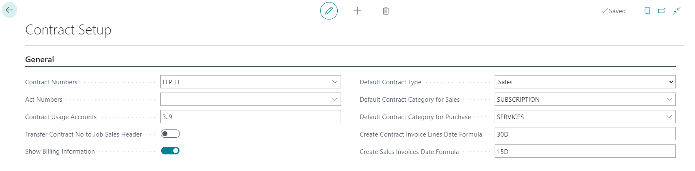</a>

|Field|Explanation|
|---|---| 
| **_Contract numbers_** | For defining contract number series. Value can be chosen from **No. Series List**.|
| **_Contract Usage Accounts_** | Allows to define a GL accounts filter for contract usage calculation. For an example income and expense accounts on which you expect transaction related to contracts. It is advisable to exclude VAT, payables and receivables accounts. You can define specific accounts and/or an accounts range (for an example range 30000..90000).|
|**_Default Contract Type_**|Specifies default Contract Type for new contracts.
|**_Def. Contract Category Sales_**|Specifies default Contract Category for sales contracts.
|**_Def. Contract Category Purchase_**|Specifies default Contract Category for purchase contracts.
|**_Contract Report ID_**|Specifies default Report ID for Contract printouts, it will be by default transferred to new Contract Categories.

_Features_

|Field|Explanation|
|---|---| 
|**_Enable Multiple Partners_**|Enables Multiple Partners functionality.

_Billing related setup_

|Field|Explanation|
|---|---| 
|**_Show Billing Information_**|Enables Billing Information tab on sales contracts.
|**_Create Contract Invoice Lines Date Formula_**|Specifies default date formula for Next Billing Date in Create Contract Invoice Lines (CM).
|**_Create Sales Invoices Date Formula_**|Specifies default date formula for Posting Date in Create Sales Invoices (CM).

_Jobs related setup_

|Field|Explanation|
|---|---| 
|**_Show job related fields_** |Enables Jobs related fields on contract card and lines.
|**_Default Job Planning Line Line Type_** |Specifies default Line Type for Job Planning Line when Job Planning Line will be created from Contract Line using **Send to Job functionality**.
|**_Transfer Contract No to Job Sales Header_** |Enables transferring Contract No. from Job Card to new Job Invoice Header.

<a href="https://apps.itera.ee/apps/contract-management/docs/en-US/ContManSetupContactsENG.png" target="_blank">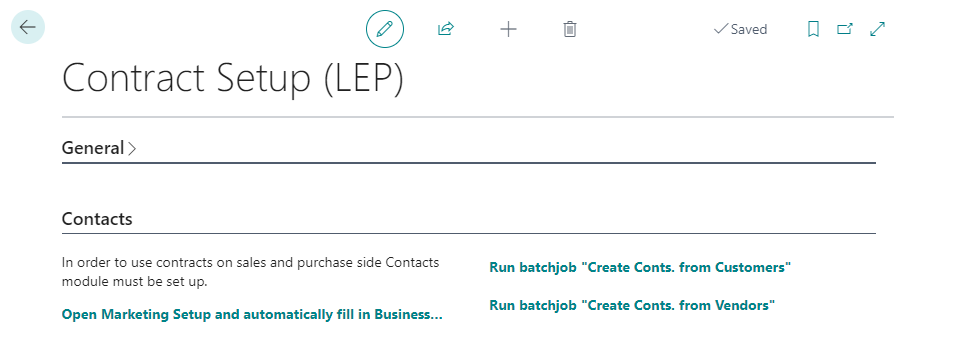</a>

_Contacts related initial setup if Contacts module not in use_

|Field|Explanation|
|---|---| 
|**_Open Marketing Setup and automatically fill in Business Relation Codes for Customer and Vendor, Contacts number series._** |Opens Marketing Setup and automatically fills in Business Relation code for Customers and Vendors if those are empty. Also creates and fills in Contact number series if the field is empty.
|**_Run Batchjob "Create Conts. from Customers_** |Runs BC batchjob that creates Contacts from Customers.
|**_Run Batchjob "Create Conts. from Vendors_** |Runs BC batchjob that creates Contacts from Vendors.

----

### Contract Categories

Contract categories allow you to define different type of categories in order to divide your contracts into different groups.

<a href="https://apps.itera.ee/apps/contract-management/docs/en-US/ContManContCategoriesENG.png" target="_blank">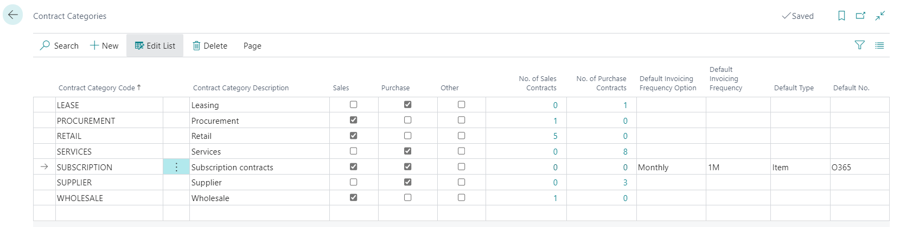</a>

|Field| Explanation|
|---|---| 
| **_Contract Category Code_** | Specifies a category code for the contract.|
| **_Contract Category Description_** | Description to define which contracts are categorized to this category|
|**_Sales, Purchase, Other_**| Sales should be marked if category should be available on sales contracts (Type **Sales**), Purchase should be marked if category should be available on purchase contracts (Type **Purchase**), Other should be marked if category should be available other contracts (Type **Other**).
|**_No. of Sales Contracts_** and **_No. of Purchase contracts_**| Shows number of Sales/Purchase contracts in that category.|
|**_Transfer Ext. Contract No. to Sales Doc._**| Specifies default for new Contracts in this category for transferring Ext. Contract No. to Sales Documents header into field External Document No.|
| **_Contract Report ID_** | Specifies default, for new Contracts in this category, Contract Report ID that is the base for contract printout.|
| **_Contract Layout Description_** | Specifies default, for new Contracts in this category, Contract Layout Description - selected from customer defined Custom Report Layouts for specified Report ID.|

_Billing related category setup_

|Field|Explanation|
|---|---| 
| **_Def. Invoicing Frequency Option_** | Specifies default Invoicing Frequency Option for contracts in this category.|
| **_Invoicing Frequency"_** | Specifies default Invoicing Frequency for contracts in this category.|
| **_Default Type_** | Specifies default Type for contract lines for contracts in this category.|
| **_Default No._** | Specifies default No. for contract lines for contracts in this category.|

---
 
## Use
### Create contract

With contract management it is possible to manage purchase, sales and other contracts. For creating a new contract you must open **Contracts** and use button **+New** in order to create a new entry.

An empty **Contract card** opens where you can fill and track following fields:

<a href="https://apps.itera.ee/apps/contract-management/docs/en-US/ContManContractCardENG.png" target="_blank">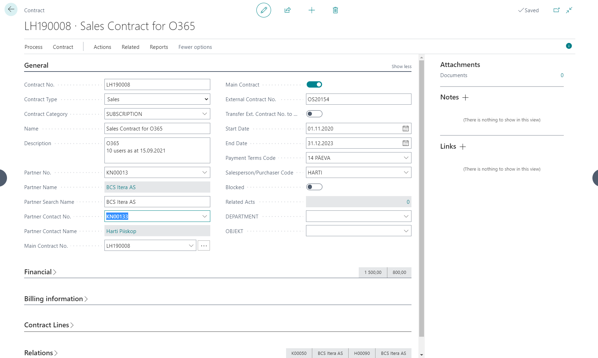</a>

|Field| Explanation|
|---|---| 
| Contract No.* | Is filled automatically according to defined Number Series from **Contract Setup**.
| Contract Type* | Defines if it is a purchase, sales or other type of contract. Option also defines if that contract can be chosen to Purchase document (**Purchase**) or to Sales document (**Sales**).
| Contract Category** | To classify contract and to get category based default values to contract card you can select contract category. Selection from the Contract Category list.|
| Name and Description** | For entering contract and short description.
| Partner No.* | Allows to choose contract partner from **Contact list**. If contact is related to a **Customer** or **Vendor** then related information will be displayed on **Relations** tab  on fields _Customer No. and Name_ and _Vendor No. and Name_. 
|Main Contract No. | Allows to group contracts under a common value (Main Contract), that can be chosen from **Contract List** filtered by field **Main Contract**. Default value is contract's own number.
|Main Contract| Allows that contract to be chosen as main contract.
|Framework Contract| Allows to track framework contracts. Restricts usage of this contract on sales and purchase documents. Completion will be taken from subcontract completion.
|External Contract No. | Allows to enter partners contract number.
|Transfer Ext. Contract No. to Sales Doc. | Allows to choose that if Contract No. will be selected to sales header then External Contract No. will be transferred to field External Doc. No.|
| Start and End Dates** | Allows to define validity dates of the contract. Field is informative.
| Payment Terms | Allows to define agreed payment terms. Value will be transferred to Sales/Purchase header after selecting contract in document header.
|Salesperson/Purchaser Code| Specifies a code for the salesperson/purchaser who is responsible for the contract. Value will be transferred to Sales/Purchase header after selecting contract in document header.
| Blocked | Allows to mark contract as Blocked. Contract will no longer be displayed in drop down list on purchase and sales documents, job and job planning lines.

On **Finance** tab you can fill and track following fields:

<a href="https://apps.itera.ee/apps/contract-management/docs/et-EE/ContManCompletionTrackingENG.png" target="_blank">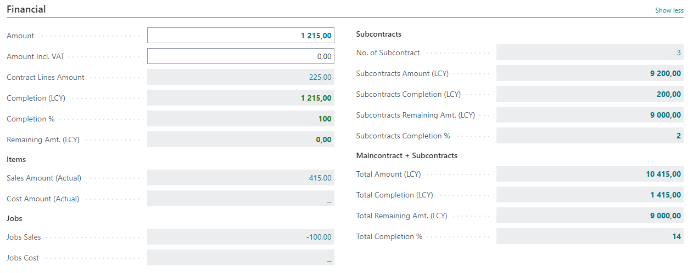</a>

|Field| Explanation|
|---|---| 
| Amount** | Allows to enter contract amount, this amount is base for calculating the reminder of the contract.
| Amount Incl. VAT | Allows to enter contract amount including VAT.
| Completion (LCY) | Displays contract related amounts from **General Ledger Entries**. Account filter from the **Contract Setup** has been applied to entries.
| Completion % | Displays completion percentage that is calculated on the basis of fields **_Amount_** and **_Completion (LCY)_**.
| Reminder (LCY) | Displays contract remaining amount that is calculated on the basis of fields **_Amount_** and **_Completion (LCY)_**.
| No. of subcontract | Displays the number of related subcontracts i.e. contracts that have current contract selected as their main contract. Main contract itself is not accounted.|
| Subcontracts completion (LCY) | Displays subcontracts **_Completion (LCY)_** amount. Main contract completion is not included.|

On **Relations** tab you can fill and track following fields:

<a href="https://apps.itera.ee/apps/contract-management/docs/et-EE/ContManContractCardRelationsENG.png" target="_blank">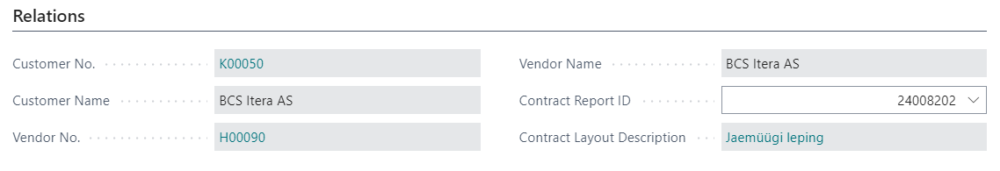</a>

Fields displayed on fast tab **Relations** (Customer No. and Name, Vendor No. and Name) are filled automatically after partner selection. Fields will only be filled if the selected **Contact** is related to **Customer** and/or **Vendor**. If the relation will be created later, then contract must be updated manually by pressing button **Update Customer/Vendor link** on contract card. This updates Contact's relations with Customer and Vendor on contract.

|Field| Explanation|
|---|---|
| Contract Report ID | Specifies Contract Report ID for this specific contract that is the base for contract printout.|
| Contract Layout Description | Specifies Contract Layout Description for this contract - selected from customer defined Custom Report Layouts that are specified for Report ID.|

*_Fields that must be filled_
**_Fields that are advisable to fill_

#### Multiple partners

If the functionality is enabled in **Contract setup** you can open **Contract partners** from **Contract Card** or **Contract List**.
Following window will be opened:

<a href="https://apps.itera.ee/apps/contract-management/docs/en-US/ContManContractPartnersENG.png" target="_blank">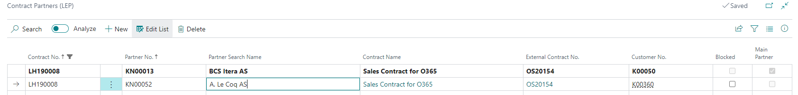</a>

Add additonal partners to use with same contract. You can then use this contract on sales and invoice documents created for this partner.
**Main partner** field will show which partner is selected on **Contract card**.

#### Copy contract

Open **Contracts List** or **Contract Card** and use action **Copy Contract**.
Following window will be opened:

<a href="https://apps.itera.ee/apps/contract-management/docs/en-US/ContManCopyContractENG.png" target="_blank">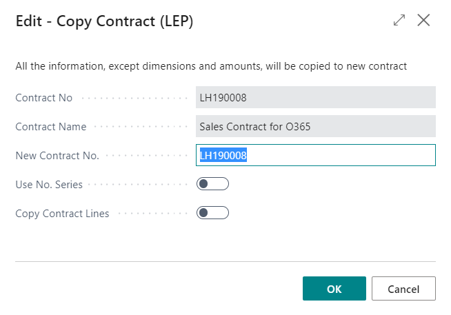</a>

Fill in **New contract no.**, if you would like to assign number manually, or mark **Use No. Series**, if you would like to take the number from number series. Additionally you can decide if contract lines will be copied - **Copy Contract Lines* 
* By default **Contract No.** and **Contract Name** will be filled with information from the contract that is being copied. 

Press **OK**.

**Contract Card** will be opened with new contract data, from which dimension and amount info has been cleared during copying.

---
 
### Using contracts on purchase and sales documents
On sales and purchase document headers you can select appropriate contract from **Contract List** in the field **_Contract No._**. If contract has been selected in the header then it will be automatically transferred to lines. It is possible to change contract number on lines. 

#### _Important_
---
_Selection of contracts that can be chosen to document is limited with the following:_
- _Contract type - on sales documents you can select contracts with the type of **Sales** and on purchase documents with the type of **Purchase**._
- _Buyer or Seller number - sales documents **Sell-To Customer No.** and purchase documents **Buy-From Vendor No.**._
- _**Blocked** contracts will be left out._

_If there is no contract in the selection that meets the requirement, then it might be due to Customer/Vendor relations that have not been updated on contract card. In order to update the relations button **Update Customer/Vendor link** must be pressed on related contract card.This updates Contact's relations with Customer and Vendor on contract_.

---

Contract number will be transferred to posted documents, **General Ledger Entries**, customer and vendor ledgers and **Job Ledger Entries** after posting. 

#### _Important_

--- 
_It must be taken into account that document header contract number will be transferred to customer and vendor ledgers. If different contract have been used on lines then those will be transferred to related income and expenses accounts._

---

### Contract completion tracking

You can track the completion and reminder of the contract from the **Contract List** or **Contract Card** by checking following fields:

- **Completion (LCY)** - displays contract related amounts from **General Ledger Entries**. Account filter from the **Contract Setup** has been applied to entries.
- **Reminder (LCY)** - displays contract remaining amount that is calculated on the basis of fields **_Amount_** and **_Completion (LCY)_**.

Additionally it is possible to open list of related **General Ledger Entries** by using **Completion entries** button in contract list or on contract card.
 
 ---

### Using contracts in Jobs
It is possible to use contract in Job module on **Job Card** and in **Job Planning Lines**.

**Job Card** - it is possible to enter related sales contract to a job by selecting appropriate contract from **Contract List** in the field **_Contract No._**  

Selection of contracts that can be chosen to job is limited with the following:
- Contract Type - contracts with type **Sales** can be used for jobs.
- Customer - contracts that are related to **_Bill-To Customer No._** from job card can be used.
- **Blocked** contracts will be left out.

Contract will be transferred to **Sales Invoice** when creating an invoice for a job by using action **_Create Job Sales Invoice_**.

**Job Planning Lines** - it is possible to enter **_Partner No._** and related **_Contract No._** to job planning lines. That allows track, for an example, if you already have a contract with subcontractor or no for a specific task. Later it will help to track completion..

Selection of contracts that can be chosen to job planning line is limited with the following:
- Partner - contracts that are related to selected **_Partner No._** can be used.
- **Blocked** contracts will be left out.

---

## Billing

You can enter billing information on contract card and then fill in contract lines. After that billing lines can be created, in order to check possible deviations and to have a longer view, and finally sales documents can be created.

#### _Important_

--- 
_**Billing Information** tab becomes visible only if it is allowed in **Contract Setup** and on contracts of type **Sales**! **Contract Lines** tab becomes visible after billing information date related fields are filled in and **Add Contract Lines** has been clicked!_

---

On **Billing Information** tab you can fill following fields:

<a href="https://apps.itera.ee/apps/contract-management/docs/en-US/ContManBillingInfoENG.png" target="_blank">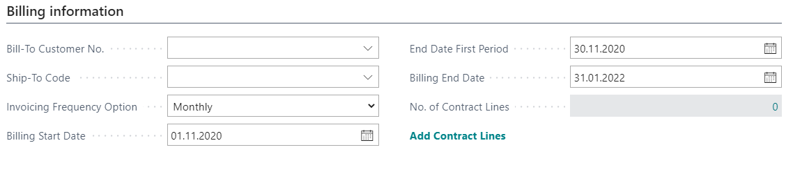</a>

|Field|Explanation|
|---|---| 
| **_Bill-to Customer No._** | Specifies Bill-To Customer. If not filled in Customer default value will be used on invoice creation.|
| **_Ship-to Code_** | Specifies Ship-To Code. If not filled in Customer default value will be used on invoice creation.|
| **_Invoicing Frequency Option_** | Specifies default Invoicing Frequency Option for lines.|
| **_Invoicing Frequency_** | Specifies default Invoicing Frequency for lines. By default field is not visible.|
| **_Billing Start Date_** | Specifies default Billing Start Date for lines.|
| **_End Date First Period_** | Specifies default End Date of the first billing period for lines. For an example this field allows to play with the length of the first period in order to adjust future periods to fit into full months.|
| **_Billing End Date_** | Specifies default Billing End Date for lines.|
| **_Add Contract Lines_** | Enables **Contract Lines** and inserts first contract line with default values from **Contract Category** and **Billing Information** tab.|

On **Contract Lines** tab you can fill following fields:

<a href="https://apps.itera.ee/apps/contract-management/docs/en-US/ContManContLinesENG.png" target="_blank">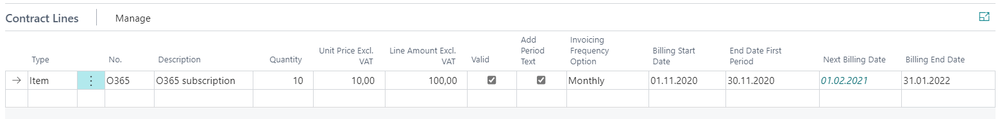</a>

|Field|Explanation|
|---|---| 
| **_Type_** | Allows to specify type. Default value will be taken from **Contract Category**.|
| **_No._** | Allows to specify No. to be billed. First line default value will be taken from **Contract Category**|
| **_Description_** | Allows to specify line description.|
| **_Quantity_** | Allows to specify quantity to be billed.|
| **_Unit of Measure Code_** | Allows to specify unit of measure to be billed. Field is not visible by default.|
| **_Unit Price Excl. VAT_** | Allows to specify line unit price to be billed.|
| **_Line Amount Excl. VAT_** | Displays calculated line amount. Field is not editable.|
| **_Valid_** | Allows to specify if line is valid or not. Default value is Valid.|
| **_Add Period Text_** | Allows to specify if new text line with period information will be added after this line when creating invoice information.|
| **_Invoicing Frequency Option_** | Specifies billing period/frequency for current line. Default value will be taken from **Billing Information** tab.|
| **_Billing Start Date_** | Allows to specify Billing Start Date for current line.|
| **_End Date First Period_** | Allows to specify End Date First Period for current line. Default value will be taken from **Billing Information** tab.|
| **_Next Billing Date_** | Displays **Next Billing Date** (next period start date) for current line after [Create Contract Invoice Lines](#create-contract-invoice-lines) has been run|
| **_Billing End Date_** | Allows to specify Billing End Date for current line.. Default value will be taken from **Billing Information** tab.|

Contract line based sales orders/invoices creation consists of two steps.

### Create Contract Invoice Lines
First step is to create **Contract Invoice Lines**.

Open **Contracts List** or **Contract Card** and use action **Create Contract Invoice Lines (CM)**.
Following window will be opened:

<a href="https://apps.itera.ee/apps/contract-management/docs/en-US/ContManCreateContInvLinesENG.png" target="_blank">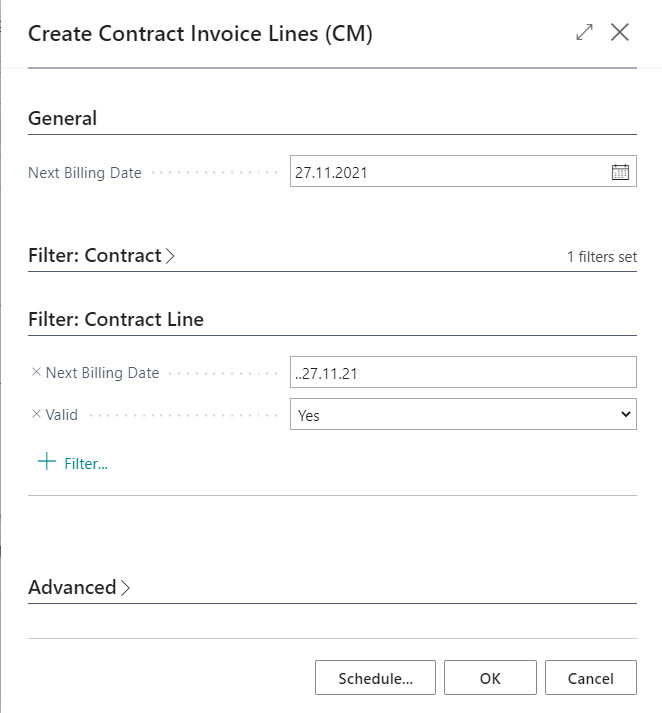</a>

Fill in **Next Billing Date**, this date will be an end date for a range that will be applied to **Valid** contract lines. It will be applied to **Next Invoicing Date** or to **Billing Start Date** (if the other is empty) and **Contract Invoice Lines** will be created for each **Contract Line** that meets the filtering criteria. 
* By default it is filled with Today + date formula from **_Create Contract Invoice Lines Date Formula_** in **Contract Setup**.
* Additional filters can be applied from **Contracts** or **Contract Lines**.
* If clicked from **Contract Card** then **_Contract No_** filter will be entered automatically. 

Press **OK**.

Use action **Contract Invoice Lines** from **Contract Card** to open list. Check if lines were created and if they look OK for creating invoices/orders. _List is not editable_.

<a href="https://apps.itera.ee/apps/contract-management/docs/en-US/ContManContInvLinesENG.png" target="_blank">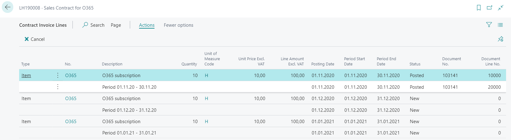</a>

Some of the fields need no explanation. Other will be explained below.

|Field|Explanation|
|---|---| 
| **_Posting Date_** | By default **Period Start Date**.|
| **_Period Start Date_** and **_Period End Date_**  | Are reflecting the actual billing period|
| **_Status_** | Shows status of current line. **New** - First status for all created lines. Also line gets this status back when it is removed from order/invoice. or removed . **Order** - **Sales Order** has been created from that line. **Invoice** - **Sales Invoice** has been created from that line. **Posted** - involved sales order/invoice has been posted. **Canceled** - line has been canceled by using action **Cancel**, only **New** lines can be canceled.|
| **_Document No._** | Shows document number of the involved document (order, invoice, posted invoice).|

---

### Create Sales Invoices
Second step is to create **Sales Orders** or **Sales Invoices**.

Open **Contracts List** or **Contract Card** and use action **Create Sales Invoices (CM)**.
Following window will be opened:

<a href="https://apps.itera.ee/apps/contract-management/docs/en-US/ContManCreateSalesInvENG.png" target="_blank">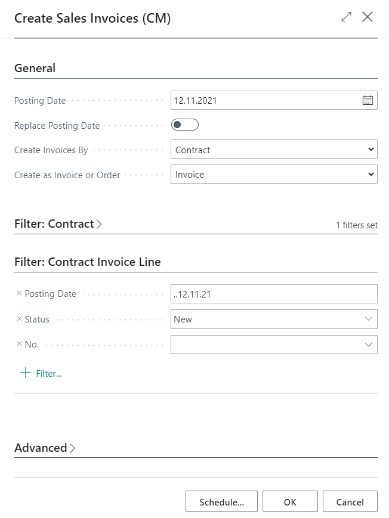</a>

Fill in **Posting Date**, this date will be an end date for a range that will be applied to **Contract Invoice Lines**. It will be applied to **Posting Date** and **Sales Invoices/Orders** will be created for contract invoice lines that meet the filtering criteria and combined according to **Create Invoices By**.
* By default it is filled with Today + date formula from **_Create Sales Invoices Date Formula_** in **Contract Setup**.
* Additional filters can be applied from **Contracts** or **Contract Invoice Lines**.
* If clicked from **Contract Card** then **_Contract No_** filter will be entered automatically. 

|Field|Explanation|
|---|---| 
| **_Replace Posting Date_** | Allows to replace invoice/order **Posting Date**. Otherwise Posting Date will be taken from Contract Invoice Line. |
| **_Create Invoices By_** | Allows to select how the lines should be grouped among documents. **Contract** - one invoice/order for each contract. Only lines from one contract will be included in one invoice/order. **Customer** - one invoice/order per customer. Lines from different contracts that have the same customer will be included in one invoice/order. **Main Contract** - one invoice/order per main contract. Lines from different contracts that have the same main contract will be included in one invoice/order.|
| **_Create as Invoice or Order_** | Allows to select which type of sales documents should be created: **Invoices** (default) or **Orders**.|

Press **OK**.

# Collateral Management

Collateral management can be handled in two ways. The solution type and where it is used (Purchase, Sales) can be configured in Contract Setup.

### Guarantee

In the Guarantee solution, the logic is based on document lines and Guarantee ledger entries (similar to customer/vendor-specific prepayments).

Can be used with both purchase invoices and purchase orders, as well as sales invoices and sales orders.

For example, in purchasing, an additional negative line is added to the expense line using the collateral account.

Collateral accounts must be configured so that they are excluded from the INF report.

### Retentions

In the Retention solution, collateral calculation and logic are handled through customer/vendor ledger entries. The customer/vendor ledger amount is split during posting.

Can be used only with purchase invoices and sales invoices.

A prerequisite is that multiple customer/vendor posting groups are allowed for both customers and vendors.

# Setup

## Contract Setup (Collateral Management FastTab)

In Contract Setup, it is possible to define which solution type is used and where it is applied, as well as configure additional settings.

<a href="https://apps.itera.ee/apps/contract-management/docs/en-US/ContManColSetupENG.png" target="_blank">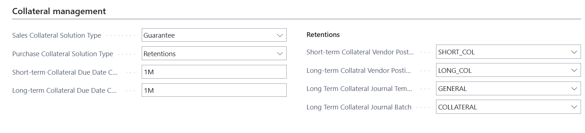</a>

### Sales Collateral Solution Type

| Value | Description |
|----------|----------|
| blank | collaterals are not used. |
| Collateral | uses the Guarantee ledger entry solution. |
| Retention | uses the customer/vendor ledger entry solution. |

### Purch Collateral Solution Type

| Value | Description |
|----------|----------|
| blank | collaterals are not used. |
| Collateral | uses the Guarantee ledger entry solution. |
| Retention | uses the customer/vendor ledger entry solution. |

### Due Date Settings

| Field | Description |
|-------|----------|
| Short-t. Ret. Due Date Calc. | Specifies the date formula used to calculate the expected due date of a short-term collateral. Used when no Contract is assigned to the entry. |
| Long-t. Ret.Due Date Calc | Specifies the date formula used to calculate the expected due date of a long-term collateral. Used when no Contract is assigned to the entry. |

### Retentions

| Field | Description |
|-------|----------|
| ShortTerm Col.Vend.Post.Gr, LongTerm Col. Vend.Post.Gr | Specifies the vendor posting groups used for posting collaterals. |
| ShortTerm Col.Cust.Post.Gr, LongTerm Col. Cust.Post.Gr | Specifies the customer posting groups used for posting collaterals. |
| LongTerm Col Journal Template, LongTerm Col Journal Batch | Specifies the general journal template and batch where Long-term Collateral entries are created when using the Calculate Long-Term Collateral function from customer/vendor ledger entries. |

## Vendor/Customer Posting Groups

### Create New Posting Groups (Retention Solution)

Create new posting groups for Short-term and Long-term Collaterals and assign the collateral account to the Payables Account field.

### Configure Existing Posting Groups (Collateral Solution)

Add the appropriate G/L accounts to the Short-term Collateral Account and Long-term Collateral Account fields in the existing posting groups.

## Contract Card (Collaterals FastTab)

<a href="https://apps.itera.ee/apps/contract-management/docs/en-US/ConManCardColENG.png" target="_blank">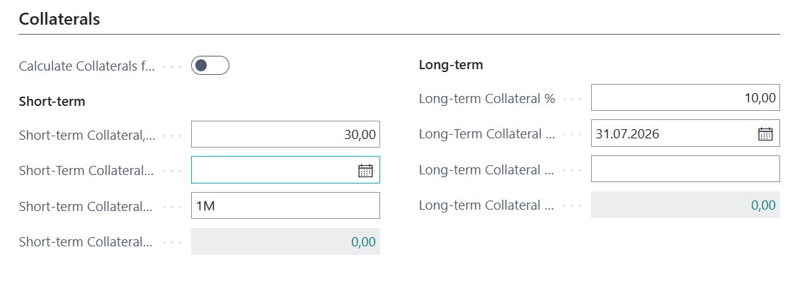</a>

| Field | Description |
|-------|----------|
| Calculate Collaterals from Amount incl. VAT | Specifies whether collateral amounts are calculated from the amount excluding VAT or including VAT. |
| Short-term Collateral, % | Specifies the short-term collateral percentage used in collateral calculation. |
| Short-Term Collateral Due Date | Specifies the date on which the short-term collateral is expected to be released. |
| Short-term Collateral Due Date Calculation | Specifies the date formula used to calculate the short-term collateral due date. The document posting date is used as the base date. |
| Long-term Collateral % | Specifies the long-term collateral percentage used in collateral calculation. |
| Long-Term Collateral Due Date | Specifies the date on which the long-term collateral is expected to be released. |
| Long-term Collateral Due Date Calculation | Specifies the date formula used to calculate the long-term collateral due date. The document posting date is used as the base date. |

# Usage (Retentions)

## Purchase

### Purchase Invoice

#### Purchase Invoice Fields

| Field | Description |
|-------|----------|
| Short-term Collateral Amount | Specifies the short-term collateral amount. During posting, a vendor ledger entry is created for the specified amount and the Collateral Type is set to Short-term. In addition, the value STR is assigned to the On Hold field. |
| Short-term Collateral Due Date | Specifies the expected due date of the short-term collateral. During posting, this date is assigned as the due date of the created vendor ledger entry. |
| Long-term Collateral Amount | Specifies the long-term collateral amount. During posting, a vendor ledger entry is created for the specified amount and the Collateral Type is set to Long-term. In addition, the value LTR is assigned to the On Hold field. |
| Long-term Collateral Due Date | Specifies the expected due date of the long-term collateral. During posting, this date is assigned as the due date of the created vendor ledger entry. |

#### Actions on Purchase Invoice

<a href="https://apps.itera.ee/apps/contract-management/docs/et-EE/ConManColActionsENG.png" target="_blank">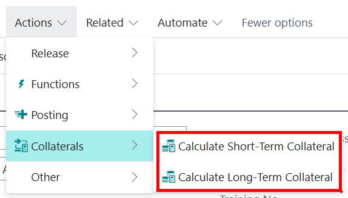</a>

##### Calculate Short-Term Collateral

Calculates the short-term collateral according to the setup on the Contract Card and populates the Short-term Collateral Amount and Short-term Collateral Due Date fields on the purchase invoice.

Note! The action is visible only when a Contract No. has been selected on the document.

##### Calculate Long-Term Collateral

Calculates the long-term collateral according to the setup on the Contract Card and populates the Long-term Collateral Amount and Long-term Collateral Due Date fields on the purchase invoice.

Note! The action is visible only when a Contract No. has been selected on the document.

### Vendor Ledger Entries

#### Vendor Ledger Entry Fields

##### Collateral Type

- Short-term – assigned automatically to short-term collateral entries.
- Long-term – assigned automatically to long-term collateral entries.

#### Vendor Ledger Entry Actions

##### Calculate Long-Term Collateral

Works only when the selected entry or entries have the Collateral Type set to Short-term.

A page is displayed where it is possible to specify the Document No., Posting Date, Long-term Collateral Amount, and Long-term Collateral Due Date.

This function is used when long-term collateral information was not specified during invoice posting.

When the Create Entries action is selected, the configured General Journal Batch is opened containing a closing entry for the short-term collateral and a new long-term collateral entry.

During posting, the short-term collateral vendor ledger entry is applied against the corresponding short-term collateral entry and a new long-term collateral vendor ledger entry is created.

## Sales

### Sales Invoice

#### Sales Invoice Fields

| Field | Description |
|-------|----------|
| Short-term Collateral Amount | Specifies the short-term collateral amount. During posting, a customer ledger entry is created for the specified amount and the Collateral Type is set to Short-term. In addition, the value STR is assigned to the On Hold field. |
| Short-term Collateral Due Date | Specifies the expected due date of the short-term collateral. During posting, this date is assigned as the due date of the created customer ledger entry. |
| Long-term Collateral Amount | Specifies the long-term collateral amount. During posting, a customer ledger entry is created for the specified amount and the Collateral Type is set to Long-term. In addition, the value LTR is assigned to the On Hold field. |
| Long-term Collateral Due Date | Specifies the expected due date of the long-term collateral. During posting, this date is assigned as the due date of the created customer ledger entry. |

#### Actions on Sales Invoice

##### Calculate Short-Term Collateral

Calculates the short-term collateral according to the setup on the Contract Card and populates the Short-term Collateral Amount and Short-term Collateral Due Date fields on the sales invoice.

Note! The action is visible only when a Contract No. has been selected on the document.

##### Calculate Long-Term Collateral

Calculates the long-term collateral according to the setup on the Contract Card and populates the Long-term Collateral Amount and Long-term Collateral Due Date fields on the sales invoice.

Note! The action is visible only when a Contract No. has been selected on the document.

### Customer Ledger Entries

#### Customer Ledger Entry Fields

##### Collateral Type

- Short-term – assigned automatically to short-term collateral entries.
- Long-term – assigned automatically to long-term collateral entries.

#### Customer Ledger Entry Actions

##### Calculate Long-Term Collateral

Works only when the selected entry or entries have the Collateral Type set to Short-term.

A page is displayed where it is possible to specify the Document No., Posting Date, Long-term Collateral Amount, and Long-term Collateral Due Date.

This function is used when long-term collateral information was not specified during invoice posting.

When the Create Entries action is selected, the configured General Journal Batch is opened containing a closing entry for the short-term collateral and a new long-term collateral entry.

During posting, the short-term collateral customer ledger entry is applied against the corresponding short-term collateral entry and a new long-term collateral customer ledger entry is created.

# Usage (Guarantee)

## Purchase

### Collateral Retention

The following actions are available on purchase invoices and purchase orders:

#### Calculate Short-Term Collateral

Calculates the short-term collateral based on the purchase document line amounts and the conditions configured on the Contract Card, and adds the result as a new purchase line.

Note! The action is visible only when a Contract No. has been selected on the purchase document.

#### Calculate Long-Term Collateral

Calculates the long-term collateral based on the purchase document line amounts and the conditions configured on the Contract Card, and adds the result as a new purchase line.

Note! The action is visible only when a Contract No. has been selected on the purchase document.

When the purchase invoice is posted, open vendor Guarantee ledger entries are created. The expected due date of the entry is calculated based on the collateral due date calculation formula.

### Collateral Payment

Collateral payments can be initiated from a purchase invoice using the Get Vendor Short-Term Collateral action.

#### Prerequisites

- A Contract No. must be assigned to the purchase invoice.

The page displays all open Guarantee ledger entries that meet the following criteria:

- same vendor,
- same currency,
- same collateral type,
- Open = Yes.

The user selects the appropriate Guarantee ledger entry.

As a result, a new purchase line is added to the purchase invoice using the remaining amount of the Guarante ledger entry.

When the purchase invoice is posted:

- a new vendor Guarantee ledger entry is created,
- the remaining amount of the original entry is reduced.

When the collateral is fully paid out, the Open field of the Guarantee ledger entry is updated to No.

## Sales

### Collateral Retention

The following actions are available on sales invoices and sales orders:

#### Calculate Short-Term Collateral

Calculates the short-term collateral based on the sales document line amounts and the conditions configured on the Contract Card, and adds the result as a new sales line.

Note! The action is visible only when a Contract No. has been selected on the sales document.

#### Calculate Long-Term Collateral

Calculates the long-term collateral based on the sales document line amounts and the conditions configured on the Contract Card, and adds the result as a new sales line.

Note! The action is visible only when a Contract No. has been selected on the sales document.

When the sales invoice is posted, open customer Guarantee ledger entries are created. The expected due date of the entry is calculated based on the collateral due date calculation formula.

### Collateral Release

Collateral release can be initiated from a sales invoice using the Get Customer Collateral action.

#### Prerequisites

- A Contract No. must be assigned to the sales invoice.

The page displays all open Guarantee ledger entries that meet the following criteria:

- same customer,
- same currency,
- same collateral type,
- Open = Yes.

The user selects the appropriate Guarantee ledger entry.

As a result, a new sales line is added to the sales invoice using the remaining amount of the Guarantee ledger entry.

When the sales invoice is posted:

- a new customer Guarantee ledger entry is created,
- the remaining amount of the original entry is reduced.

When the collateral is fully released, the Open field of the Guarantee ledger entry is updated to No.

## Contract Balance Updates

The system automatically updates the following fields on the Contract Card:

- Short-term Collateral Amount (Posted)
- Long-term Collateral Amount (Posted)

These values indicate the outstanding collateral amount that has not yet been paid out or released.

# Payment Schedules

Payment schedules let you plan expected payments and match them against actual entries.

## Creating Payment Schedule Lines

1. Open a Contract Card
2. Click **Navigate > Payment Schedule**
3. Add lines:

| Field | Action |
|---|---|
| **Customer/Vendor No.** | Auto-populated from contract; can override |
| **Amount (LCY)** | Enter the expected payment amount |
| **VAT Amount (LCY)** | Enter the VAT portion |
| **Document Date** | Enter the expected document date |
| **Due Date** | Enter the expected payment due date |
| **Comments** | Add notes |
| **Payment Schedule Category** | Classify the line |

## Automatic Matching

1. Navigate to **Search > Payment Schedule Lines (LEP)**
2. Click **Actions > Match with Actuals**
3. The system automatically:
   - Matches unmatched lines to Customer/Vendor Ledger Entries based on contract, partner, and date range (within the same month)
   - Sets the **Matching Method** to **Automatic**
   - Fills in **Document No.** and **External Document No.**
4. After matching, the system resolves **Paid Amount** and **Paid Date** from Detailed Ledger Entries

## Manual Matching

1. Open a payment schedule line
2. Look up the **Cust./Vend. Ledger Entry No.** field
3. Select the matching ledger entry
4. The **Matching Method** is set to **Manual**

## Cash Flow View

1. Navigate to **Search > Payment Schedule Cash Flow (LEP)**
2. View payment schedule data organized by:
   - Payment schedule categories
   - Monthly/annual periods
   - Opening/closing balances

---

For more information please contact DIGMATIX ESTONIA AS:  
https://www.digmatix.com/ee
