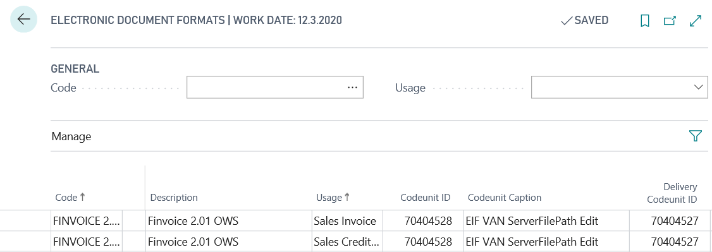

# Finvoice e-Invoicing for Finland – User Guide

Finvoice Sales e-Invoicing functionality in BC enables the following:
* Create electronical sales invoices in Finvoice format.
* Send e-Invoices B2B customers.
* Manage Factoring customers.
* Create Sales e-Invoices for Factoring company.
* Send e-Invoices to e-invoice operators.

e-Invoicing functionality could be also used without Factoring functionality.

## Settings

To use the functionality, Finvoice Sales e-Invoicing following setups must be made:

### Company Information 
Open **Company Information** and add setup data to Finvoice tab:

|**Field**|**Value**|
|-|-|
|EDI Code|Code provided by operator|
|Intermediator Code|Code provided by operator|
|Party Identifier|Company registration code|

### No. Series for Transmission No.
Necessary only, if Factoring will be used.
Open **No. Series** and create new series for Factoring transmission numbers. 

### Standard Text Code
Necessary only, if Factoring will be used.
Open **Standard Text Codes** and create new standard text for Factoring text, to be printed to invoice.

Open **Extended Texts** for created Standard text and add lines (text is given by Factoring company).
Split text to multiple lines. Text length on single line may not exceed more than 70 characters (according to Finvoice standard format). You can add Extended Texts in Finnish and in English.

### Setup Electronical Document Formats
Open **Electronic Document Formats** and insert two new Electronical Document Formats (1st for Sales Invoice and 2nd for Sales Credit Memo).
Enter the following data:

|**Field**|**Value**|
|-|-|
|Code|Fill in manually|
|Description|Fill in manually|
|Usage|Select Sales Invoice or Sales Credit Memo|
|Codeunit ID|70404528|
|Delivery Codeuint ID|70404527|

 

