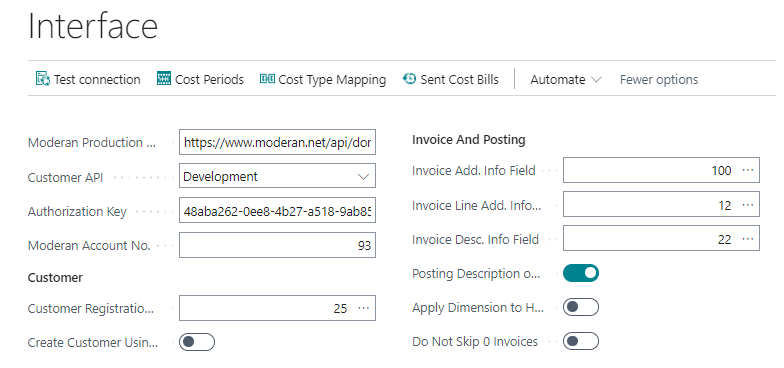
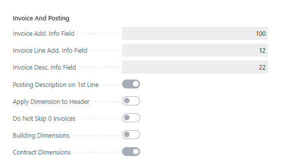
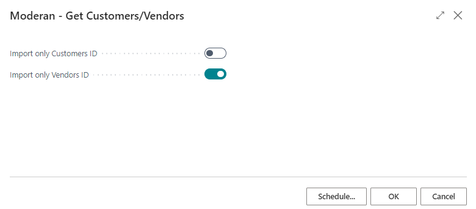
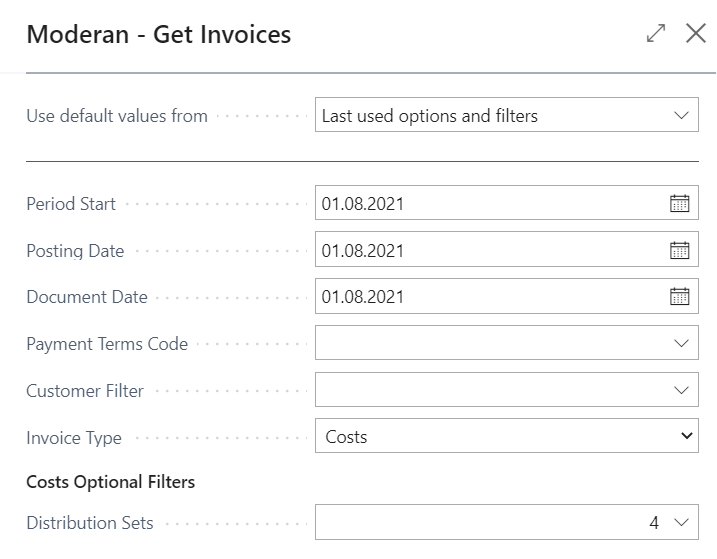
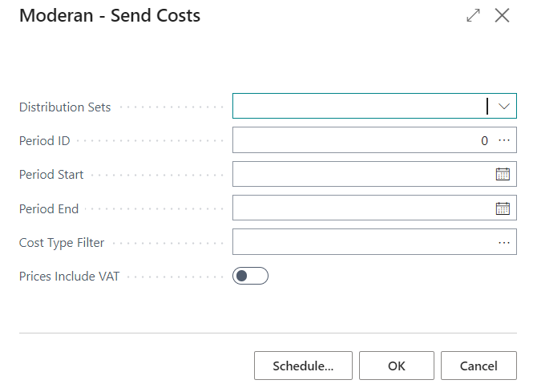

# Moderan for Business Central User Guide

Moderan Interface enables the following:
- Get Customers or Vendors from Moderan
- Get Sales invoices from Moderan
- Get Contacts from Moderan
- Send Customer Balances to Moderan
- Send Costs Invoices to Moderan

## Contents
- [Moderan Installation](#moderan-installation)
- [Menu](#menu) 
- [How to setup](#how-to-setup) 
  - [Setup API ](#setup-api)
  - [Setup customers](#setup-customers) 
  - [Setup Sales invoices number series](#setup-sales-invoices-number-series)
  - [Setup Dimensions in Moderan and BC](#setup-dimensions-in-Moderan-and-BC)
  - [Setup Payment Terms Code in Moderan and BC](#setup-payment-terms-code-in-Moderan-and-BC)
  - [Setup Accounting Codes in Moderan](#setup-accounting-codes-in-moderan)
  - [Setup Finnish e-invoices](#setup-finnish-e-invoices)
- [How to Get Customers or Vendors from Moderan](#how-to-get-customers-or-vendors-from-moderan) 
- [How to Get Invoices from Moderan](#how-to-get-invoices-from-moderan)
  - [Dimensions in the sales invoice header](#dimensions-in-the-sales-invoice-header)
  - [Job Queue](#job_queue)
  - [Periodization of Invoices](#periodization-of-invoices) 
- [How to Get Contacts from Moderan](#how-to-get-contacts-from-moderan)
- [How to Send Customer Balances to Moderan](#how-to-send-customer-balances-to-moderan)
- [Export Cost Invoices to Moderan](#Export-Cost-Invoices-to-Moderan)
  
   
  

## Moderan Installation
Open **Extension Management** and check if extension named ‘Moderan’ is installed. If not, please find and install it from AppSource or contact BCS Itera AS.

## Menu

Moderan menu items can be found in the Role centers: Accountant and Business Manager.

## How to setup

### Setup API

Open **Interface** in Moderan menu or page Moderan Interface and fill the fields as following (mandatory fields marked with *):

|Field|Description|
|---|---|
|Moderan Production URL*|Moderan URL (ask from Moderan)|
|Customer API* |Production or Development|  
|Authorization Key*|Moderan authorization key from Moderan Admin -> Integrations| 
|Moderan Account No. *|Account number in Moderan (ask from Moderan)|
|Customer Registration No. Field *|Choose which field is a Customer Business Registration No. in the Customer table, usually field no. 25|
|Create Customer Using Moderan No. |Yes - Use Moderan registration No. for creating new Customer. No - use Busines Central No.series|
|Customer e-invoices field 1 and other Customer e-invoices fields|These fields are used for the Finnish e-invoicing solution|
|Vendor Registration No. Field |Choose which field is a Vendor Business Registration No. in the Vendor table, usually field no. 25|
|Create Vendor Using Moderan No. |Yes - Use Moderan registration No. for creating new Vendor. No - use Busines Central No.series|
|Invoice Add. Info Field *|Specify the field where the sales invoice contains additional invoice information, such as the contract No. or external invoice no.|  
|Invoice Desc. Into Field *|Specify field for Invoice posting description in the Sales Header table|
|Invoice Line Add.Info Field|Specify the value of the Invoice Line Add. Info Field|
|Posting Description on 1st Line *|Yes - Invoice posting description will be included on first line on Invoice|
|Apply Dimension to Header|Yes - Applies line dimension on header| 
|Do Not Skip 0 Invoices|Default is No - invoices with 0 amount are not imported|

   
 

To test, if the connection is correct, press the button – Test connection.

  

### Organisation Types
Here is possible to add different Moderan organistions codes which are used for Customer import or for Vendor import.
Example TENANT used for Customer and SERVICE PROVIDER used for Vendor.

 

### Setup customers

**NB!** Before performing any data exchange between Business Central and Moderan, existing customers in Business Central and Moderan must be mapped. To do so, open **Customers** and fill in **Moderan ID** (located in **Invoicing** fasttab) for every customer which should be mapped.

### Setup Sales invoices number series

**NB!** It is important that Sales invoices and Posted sales invoices use different number series.

### Setup Dimensions in Moderan and BC
It is possible to use either the contract-based dimensions or the building dimension.
On the Moderan Interface page, you can specify which dimension is used.

To use Building dimensions, add the Accounting Code in the Moderan building card, in format: "Dimension:Dimension Value". 

To use Contract dimensions, add the Accounting Code in the Moderan contract card, in format: "Dimension:Dimension Value;Dimension2:Dimension Value2".

For example: OBJEKT:008; DEPARTMENT:PROD
The same dimension and dimension value must be set up in BC.

### Setup Payment Terms Code in Moderan and BC
Describe the same Payment Terms Codes in Moderan and in BC.

For example: 10 DAYS
If the Payment Terms codes ar the same in BC and in the Moderan contract, the Invoice Due Date will be calculated based on this code.

### Setup Accounting Codes in Moderan

In addition to mapping customers, services should be mapped. To do so, setup accounting codes in Moderan.

Accounting code should be in format: “Type:No.:GeneralProductPostingGroup”

For example – G/L Account:6115:RENT

  

### Setup Finnish e-invoices
Open **Interface** in Moderan menu or page Moderan Interface and fill the fields as following (mandatory fields marked with *):

|Field|Description|
|---|---|
|Customer e-invoice field 1* |The EIF EDI Code field on the Customer Card|
|Customer e-invoice field 2* |The EIF Business Identity Code field on the Customer Card|
|Customer e-invoice field 3* |The EIF Party Identifier field on the Customer Card|
|Customer e-invoice field 4* |The EIF Intermediator Code field on the Customer Card|
|Customer e-invoice field * |The Document Sending Profile field on the Customer Card, usually field no.11|
|Customer e-invoice Value * |Specify the value which is used for e-invoicing, example E-INVOICE|

 

There is a new field in the Moderan on the Organization card - E-invoices. Please put all 4 values separating them with ; and without spaces.

Example: 0037019;01976;0037019;00370192

If the e-invoices data is filled in on the Organization card in Moderan, the fields indicated in the Customer's e-invoices fields above are filled wiht Customer imports.

## How to Get Customers or Vendors from Moderan

To get customers or vendors from Moderan, run action **Moderan – Get Customers/Vendors**. Existing customers or vendors will be updated, and new customers or vendors (who have a Registration No in Moderan) created.

The customers or vendors who do not have a Registration No. will be skipped.
In general, the setting for getting Customer information should be such that the button **Import only Customers ID** is off, in this case all Customers with all data are imported.

If the customer has English as the invoicing language in Moderan, the Language code is also displayed on the BC customer card.

When new customers or vendors were created, review customer or vendor cards and fill in missing data like **Posting Groups**.

**Moderan – Get Customers/Vendors** can be setup to run automatically by using **Job Queue** functionality.

To do so, open **Job Queue Entries** and create new entry as:

|Field/Tab|Value/Description|
|-|-|
|Object Type to Run|Report|
|Object ID to Run|24007900|
|Recurrence|Indicate desired recurrence|

  

## How to Get Invoices from Moderan

To get invoices from Moderan, run action **Moderan – Get Invoices** and fill in the parameters as following:

|Field|Description|
|-|-|
|Period Start*|Choose period from which invoices will be retrieved|  
|Posting Date*|Enter Posting Date for the invoices|  
|Document Date*|Enter Document Date for the invoices|  
|Payment Terms Code|Select Payment Terms Code. This applies to invoices that do not have a payment term specified in Moderan|
|Customer Filter|If set, invoices of other customers will be skipped|  
|Invoice Type*|Choose **Rent** or **Costs** or **Fees**|  
|Cost Optional Filters*|Choose Distribution Sets |

After successful import, open **Sales Invoices.** Review, post and issue invoices. 
Separate invoices can be issued for one tenant if they are entered in Moderan as separate agreements.

If you run action **Moderan – Get Invoices** more than once for the same period and invoice type, then the following logic will apply:

|Invoice in Business Central|Explanation|
|-|-|
|Invoice does not exist|Import will create invoice|
|Invoice has not been posted|Import will update the invoice (delete old and create new)|
|Invoice has been posted|Import will skip invoice|

If the invoice amount in Moderan is 0, then an invoice will not be created in Business Central.
 

### Dimensions in the sales invoice header

To get the Dimension value in the Sales Invoice Header, the **Apply Dimension to Header** button on the **Interface** page must be turned on. 
In the Invoice header displays the Dimension value, which is the Dimension value of the last invoice line.

 

### Job Queue

**Moderan – Get Invoices** can be setup to run automatically by using **Job Queue** functionality.

To do so, open **Job Queue Entries** and create new entry as:

|Field/Tab|Value/Description|
|-|-|
|Object Type to Run|Report|
|Object ID to Run|24007901|
|Recurrence|Indicate desired recurrence|

 

### Periodization of Invoices

If there are services on the invoice which are not for the current period, the **Periodization** checkmark will be set on the invoice header and according message will be shown in the end of import.

User can filter out these invoices and perform periodization tasks if required.

  

## How to Get Contacts from Moderan

In order to synchronize the contact card with a customer card, you must fill in the relevant field in the **Bus. Relation Code** for section on the **Interactions** FastTab on the **Marketing Setup** page.

If you have customers that you want to create contact cards for, you can use the **Create Contacts from Custome** batch jobs to create contacts from the existing data. When you create a contact this way, the contact information is afterwards synchronized with the related customer information. 

After customers' company-type contacts are created, it is possible to import person-type contacts from **Moderan**.

### Setup Moderan Organisation Roles

Open **Moderan Organisation Roles** page and insert lines, which links Moderan Organisation Roles with Organisation Level Codes in BC.
Priority can be used to determine the most important role of the contact person.

### Setup Salutations

Open **Salutations** page and add the codes, which used as Gender codes in Moderan.

### Get Contacts

To get customers or vendors from Moderan, run action **Moderan – Get Contacts** and press OK. Contacts are imported from Moderan into company-type contacts. The contact is assigned a role according to the prority on the **Moderan Organisation Roles** page.

**NB!** Only contacts that have the role described on the **Moderan Organisation Roles** page will be imported.

**Moderan – Get Contacts** can be setup to run automatically by using **Job Queue** functionality.

To do so, open **Job Queue Entries** and create new entry as:

|Field/Tab|Value/Description|
|-|-|
|Object Type to Run|Report|
|Object ID to Run|24007903|
|Recurrence|Indicate desired recurrence|

 

## How to Send Customer Balances to Moderan

To send customer overdue balances from Business Central to Moderan, run action **Moderan – Send Balances**.

Action will send current balance information for all the customers with **Moderan ID**.

Sending balances can be setup to run automatically by using **Job Queue** functionality.

To do so, open **Job Queue Entries** and create new entry as:

|Field/Tab|Value/Description|
|-|-|
|Object Type to Run|Report|
|Object ID to Run|24007902|
|Recurrence|Indicate desired recurrence|
 

## Export Cost Invoices to Moderan

### Setup
Open the **Moderan** menu, page **Interface**. Here are general settings of cost invoices: the ranges of accounts to be exported, 2 possible dimensions and whether the prices and amounts are exported with or without VAT or both cases are possible.
It is possible to send expense invoices PDF files to Moderan.

 

### Cost periods
First, new periods must be opned in Moderan, then they can be imported into BC.
Open the **Moderan** menu, page **Interface**. There ie a menu **Cost Periods** and in this page button **Get Periods**.
If the company has several different objects, Periods are imported for each Moderan objects.
It is alse possible to get different lines for the same period, if Period descriptions are different.

 

### Cost type mapping
Cost types must be decribed in Moderan.
On the page **Cost type mapping**, Moderan cost types and G/L accounts are mapped.
Open the page **Cost type mapping**, button **Get Cost Types**.
The cost types described in Moderan are imported and here is possible to link them to G/L accounts and to the dimensions.

### Send cost invoices
Open the page **Send Cost Bills** and fill the fields: choose Distribution Sets, choose Period ID, Period start and Period end.
Select the period ID to which Moderan period you want to send costs invoices and as Periods describe which BC date range the entries are taken from.
It is possible to send costs for all cost types or some cost types.

### View sent data
On the page **XML Inbound** you can see all exported and import files and errors that occurred during processing.

On the page **Sent costs** you can see the sent entries and related information.

 
