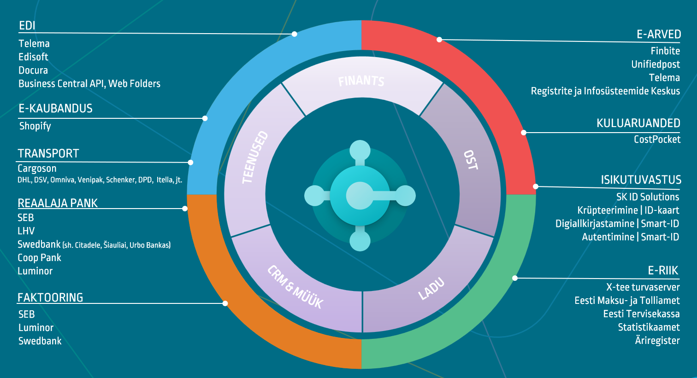

# Reaalajamajanduse pakett
Dynamics 365 Business Central on enim kasutatud Microsofti majandustarkvara nii maailmas kui ka Eestis.  

Tegemist on kogu ettevõtte tarneahelat katva terviklahendusega, mis pakub äärmiselt rikkalikku funktsionaalsust. Samas on igas riigis omad eripärad ja digitaliseerimise võimalused. Eesti on alustanud nn <a href="https://www.realtimeeconomy.ee/" target="_blank">reaalajamajanduse</a> initsiatiiviga, et muuta nii ettevõtted kui ka keskkond konkurentsivõimelisemaks.  

Sellest tulenevalt oleme liitnud ühte paketti hulga täiendavaid võimalusi, mis aitavad ettevõttel tegutseda kõige kaasaegsemas digitaliseeritud inforuumis.  

Pakett pakub digitaliseeritud suhtlust riigiga, raamatupidamisele, pankadega ja ka tarneahela teenustega. Teisisõnu saab lahenduse kasutaja enda kasutusse kõik ühes paketi, väga mitmekülgse funktsionaalsusega.  

**E-riik**
- X-tee serverteenus
- <a href="https://apps.itera.ee/apps/smart-id/docs/et-EE/app.html" target="_blank">Smart-ID (allkirjastamine ja autentimine)</a>
- ID-kaart (krüpteerimine)

**Registrid**
- <a href="https://dynamicspartnersee.github.io/apps/estonian-business-register/docs/et-EE/help.html" target="_blank">Äriregister</a>
- <a href="https://apps.itera.ee/apps/Address-Autocomplete/docs/et-EE/app.html" target="_blank">Aadressiregister (_Maa-amet, Google Maps_)</a>

**Raamatupidamine**
- <a href="https://dynamicspartnersee.github.io/apps/einvoices-for-estonia/docs/et-EE/help.html" target="_blank">E-arved - Finbite, RIK, UnifiedPost</a>, <a href="https://dynamicspartnersee.github.io/apps/telema-edi/docs/et-EE/help.html" target="_blank">Telema</a>
- <a href="https://apps.itera.ee/apps/expense-reports/docs/et-EE/app.html" target="_blank">E-kuluaruanded - CostPocket</a>

**Pangateenused**
- <a href="https://apps.itera.ee/apps/realtime-bank/docs/et-EE/app.html" target="_blank">Reaalajapank - Swedbank, SEB, LHV, COOP Pank, Luminor</a>
- <a href="https://apps.itera.ee/apps/factoring/docs/et-EE/app.html" target="_blank">Faktooring - Swedbank, SEB, LHV, Luminor</a>

**Tarneahel**
- <a href="https://dynamicspartnersee.github.io/apps/telema-edi/docs/et-EE/help.html" target="_blank">Telema EDI</a>
- <a href="https://dynamicspartnersee.github.io/apps/telema-edi/docs/et-EE/help.html" target="_blank">Edisoft EDI</a>
- <a href="https://dynamicspartnersee.github.io/apps/telema-edi/docs/et-EE/help.html" target="_blank">Docura EDI</a>

**Transport**
- <a href="https://apps.itera.ee/apps/cargoson/docs/en-US/app.html" target="_blank">Cargoson</a>
