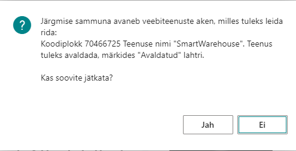
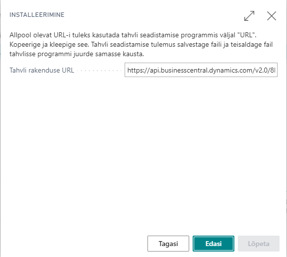
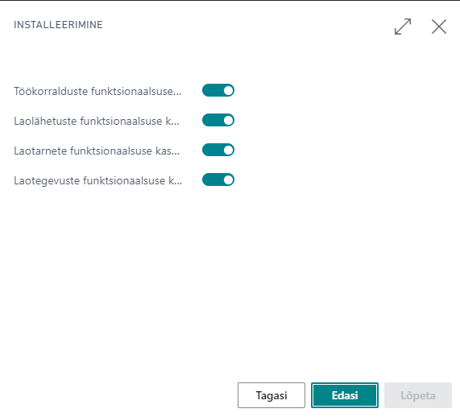
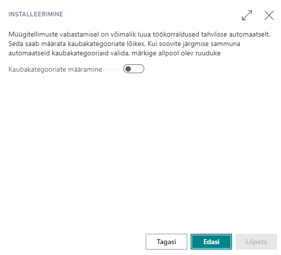
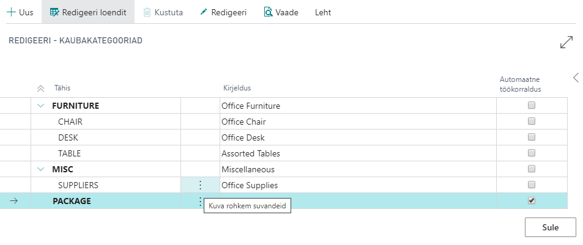
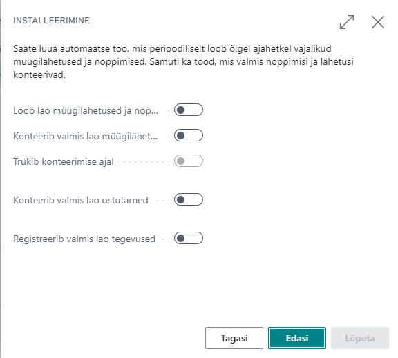
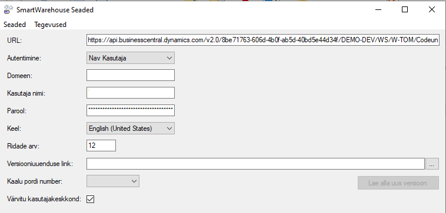
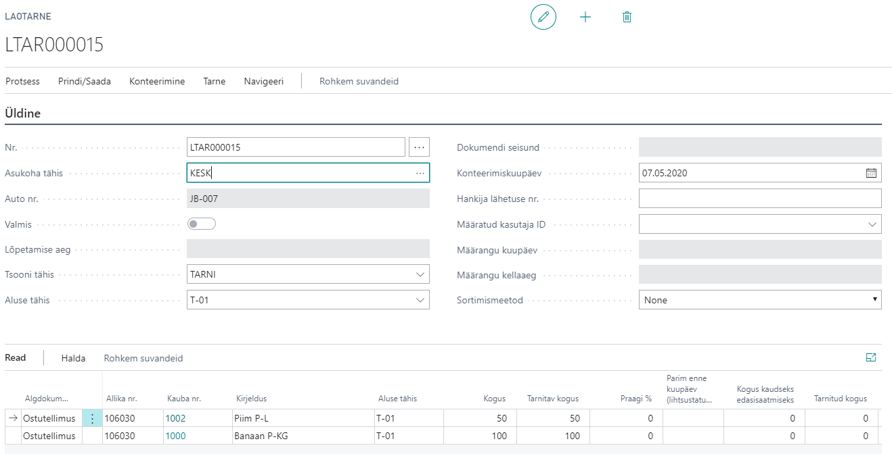
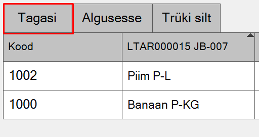
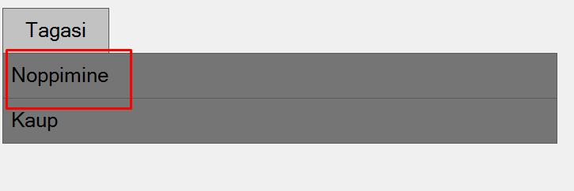

# Smart Warehouse – Kasutusjuhend

Smart Warehouse lahendus võimaldab alljärgnevat:
- Paberivabad laotegevused
- Vigade tekkimise tõenäosuse vähenemine
- Lao protsesside kiirenemine
- Business Centrali ja Smart Warehouse omavaheline automaatne infovahetus
- Veoringide määramise funktsionaalsus
- Aluste ja kastide arvestus kauba vastuvõtul
- Aegumiskuupäeva määramine kaubale
- Komplekteerimise järjekorra seadistamise võimalus
- Aluste kleepsude ja aluste kleepsude saadetistele printimise võimalus
- Kauba eluea seadistamise võimalus
- Smart Warehouse programmist on laotöötajal võimalik näha kauba laoseisu koos aegumiskuupäevadega
- Paberivaba inventuur

## Table of Contents
  - [Seadistused](#seadistused)
  - [Äpi seadistused](#äpi-seadistused)
  - [Kasutamine](#kasutamine)
  - [Ostutellimuse toimingud Business Centralis](#ostutellimuse-toimingud-Business-Centralis)
  - [Ostutellimuse toimingud Smart Warehouse programmis](#ostutellimuse-toi-mingudSmart-Warehouse-programmis)
  - [Ostutellimuse kontrollimine Business Centralis ja arveks konteerimine](#ostutellimuse-kontrollimine-Business-Centralis-ja-arveks- konteerimine)
  - [Müügitellimuse toimingud Business Centralis](#müügitellimuse-toimingud-Business-Centralis)
  - [Müügitellimuse toimingud Smart Warehouse programmis](#müügitellimuse-toimingud-Smart-Warehouse-programmis)
  - [Müügitellimuse kontrollimine Business Centralis ja arveks konteerimine](#müügitellimuse-kontrollimine-Business-Centralis-ja-arveks- konteerimine)
  - [Aluse sisu kontrollimine](#aluse-sisu-kontrollimine)

 

## Seadistused

Esmalt kontrolli, kas oled alla laadinud “ **Smart Warehouse** ” äpi. Kui see puudub võta ühendust BCS Iteraga. 

### Äpi seadistamine

Ava **Installeerimine**.
**Aktiveeri veebiteenus** ning seejärel vajuta **Edasi**.

Järgmiseks juhendatakse kasutajat leidma Smart Warehouse veebiteenus. Siin vajuta **Jah**.

Järgmiseks juhendatakse kasutajat leidma Smart Warehouse veebiteenus. Siin vajuta **Jah**.
Veebiteenuse leiad teenuste loendist ülevalt poolt.

Sulge antud leht!
Kopeeri endale tuleviku tarvis **Tahvli rakenduse URL** ja liigu **Edasi**.

|Väli|Kasutamine|
|-|-|
|Töökorralduste funktsionaalsuse kasutamine|Võimaldab vaadata töökorraldusi.|
|Laolähetuse funktsionaalsuse kasutamine|Võimaldab vaata ja luua laolähetusi.|
|Laotarne funktsionaalsuse kasutamine|Võimaldab kasutajal luua laotarnet.|
|Laotegevuste funktsionaalsuse kasutamine|Võimaldab vaadata ja luua laotegevusi.|

Kui kasutajal on vaja kõiki neid funktsionaalsusi kasutada aktiveeri need ning liigu Edasi.

Võimaldab automaatse Kaubakategooria valimist aktiveerimisel, mis saadab töökorralduse automaatselt tahvlisse. Soovi korral aktiveerige ning vajutage **Edasi**.
Kui aktiveerisite eelneva avaneb Business Centralisse seadistatud **Kaubakategooriate leht**:

Valige sealt endale soovitud kategooria ning pange linnuke kasti **Automaatne töökorraldus**. Sulgege leht. 
Järgmiseks valige Taara üld, toote konteeringu rühm:

Antud seadistus võimaldab taara ridade kaasamist Töökorralduse lõpetamisel. Vajadusel seadistage endale sobiv.
Minge **Edasi**.

|Väli|Kasutamine|
|-|-|
|Töötaja kontrollimise tõenäosuse %|Saab määrata kasutaja eksimuste tõenäosust tellimuste kokkupanemisel. Kasti numbrit kirjutades määratakse kasutajale nn supervisor, kes vastavalt seatud protsendile pisteliselt tema komplekteeritud kauba üle kontrollib|
|Kontrollitavate klientide valimine|Aktiveerimine võimaldab järgmist valikut muuta(Kontrollitavate klientide valimine käsitsi või filtreid kasutades).|
|Kontrollitavate klientide  valimine käsitsi või filtreid kasutades|Eelnev seadistus peab olema aktiveeritud, seejärel saab kasutaja otsustada, millise valiku järgi kontrollitavaid kliente valitakse.|

Minge **Edasi**.
Järgnevalt saab kasutaja aktiveerida endale soovitud automaattööd.

Vajutades **Edasi**, kuvatakse kõigi automaattööde kohta eraldi aknad algus/lõpu aegade ning sageduse seadistamiseks näiteks:

Liikuge **Edasi**.
Seadistuste viimases aknas on võimalik aktiveerida õiguste uuendamist, avada seadete akent ning tööjärjekorra kandeid. Kui soovitud read on aktiveeritud **Lõpetage** installeerimine.

Järgnevalt lehelt on võimalik endale Smart Warehouse rakendus alla laadida:

Pakkige fail lahti ning avage fail **SmartWarehouse Setup.exe**:

|Väli|Kasutamine|
|-|-|
|URL|Sinna kopeeri eelnevalt kopeeritud link.|
|Autentimine|Windows/Nav Kasutaja|
|Kasutaja nimi|Vastavalt eelnevalt tehtud valikule, kas Window või Business Central Kasutaja|
|Parool|Vastavalt eelnevalt tehtud valikule kas Window või Business Central parool|

Seejärel testi ühendust:

Kui kõik õnnestus annab server vastuse:

Mine tagasi **Business Centralisse**.
Seadista **Mõõtühikud**. Nendele mõõtühikutele, mida on vaja kasutada Smart Warehouse programmis lisa linnuke kasti **Kaaluühik**.

Järgmiseks mine lehele **Laotöötajad**.
Lisa sinna kõik töötajad, kes hakkavad programmi kasutama ning juurde vali ladu ehk **Asukoha tähis**. Kasti **Vaikimisi** lisa linnukesed nende töötajate asukohtadele, mis mida soovid määrata töötajale vaikimisi. 

## Kasutamine

### Ostutellimuse toimingud Business Centralis

Avage ostutellimused ning looge uus ostutellimus.
Kohustuslikud väljad **Hankija nimi**, **Hankija arve nr**, **Auto nr.**

Ridadele lisa kaup, koos **Asukoha tähise** ja **Kogusega**.

Eelnev info on vaja lisada, sest seda kuvatakse laotöötajale Smart Warehouse programmis.
Järgnevalt vajuta **Toimingud** -> **Vabasta** -> **Täida algselt tellitud kogus**.
Toimingu järgselt täitus ridadel **Algselt tellitud kogus**.

Vabasta tellimus!
Viimaks vajuta **Toimingud** -> **Ladu** -> **Loo Laotarne**.

### Ostutellimuse toimingud Smart Warehouse programmis

Ava **SmartWarehouse.exe.**

Logi sisse eelnevalt seadistatud Kasutajanime ja Parooliga:

Seejärel avaneb tegevuste loend:

Ostutellimuse puhul lõime Business Centralis **Laotarne**, seega avame **Laotarne** lehe.
Alljärgnev valik annab võimaluse laotarne leidmiseks **Kuupäeva**, **Hankija**, **Auto**, **Kauba järgi**.

Valides Auto, kuvatakse laotöötajale kõik ostutellimused, millel oli auto väli täidetud:

Vajuta **auto nr** väljal ning töötajale avaneb ostutellimuse read. 

|Väli|Kasutamine|
|-|-|
|Kood|Business Centralist tulev kauba kood. Pole muudetav.|
|LTAR000015 JB-007|Laotarne peal olevad tooted. Pole muudetav|
|Tellitud kogus|Ostutellimusel märgitud tellitud kogus. Pole muudetav|
|Ühik|Kaubale määratud ühik. Pole muudetav.|
|Kogus|Vajutades väljale, on võimalik sisestada tegelik kogus.|
|Praagi %|Vajutades väljale, saab määrata praagi %.|
|Partii|Kui tootele on määratud partii, saab selle sisestada.|
|Alus|Vaikimisi Business Centralist. Pole muudetav.|
|Valmis|Kui rida on kontrollitud vajuta Valmis ja toote kontrollimine on automaatselt kinnitatud. |

Osade toodete puhul on vaja täita väljad :

|Väli|Kasutamine|
|-|-|
|Aluse KG|Kui Business Centralis seadistatud tuleb automaatselt, aga saab muuta.|
|Kast KG|Kui Business Centralis seadistatud tuleb automaatselt, aga saab muuta.|
|Kaste|Kui Business Centralis seadistatud tuleb automaatselt, aga saab muuta.|
|Bruto KG|Kui Business Centralis seadistatud tuleb automaatselt, aga saab muuta.|
|Neto KG|Kui Business Centralis seadistatud tuleb automaatselt, aga saab muuta.|
|Praagi %|Vajutades väljale, saab määrata praagi %.|
|Partii|Siin lehel ei saa määrata, määratakse eelmisel lehel.|
|Valmis|Kui kõik vajalik info on seadistatud vajuta Valmis kasti linnuke.|

Vajutades nupule **Trüki silt**, on võimalik välja printida valitud tootele aluse silti.

Kui tooted on laos kontrollitud vajuta nupule **Tagasi**.

Seejärel saab valida, kas kinnitada rida, kinnitaja ja ava ladustamise või mitte kinnitada.

Vajutades **Jah, ava ladustamised** avaneb leht ladustusleht, kus saab sisestada kauba soovitud asukoha:

Kui soovitud asukoht on sisestatud ja kaup paigutatud tee linnukesed kasti **Valmis**. 
Ladustamine on registreeritud ning võid minna tagasi algusesse.

### Ostutellimuse kontrollimine Business Centralis ja arveks konteerimine

Ava eelnevate tegevuste jaoks loodud ostutellimus.
Tellimuse ridadel vajutades **Rida** -> **Kaubajälgimise read**, kuvatakse detailne info kauba kohta näiteks Smart Warehouses sisestatud **Kehtivuse lõpp**:

Lisaks saab kaubale juurde määrata:

Tellimuse ridadel vajutades **Rida** -> **Kaalumise read** kuvatakse kasutajale **Konteeritud lao kaalumise ridu**:

Kui kõik soovitud info on tellimusel olemas **Konteeri** dokument.

### Müügitellimuse toimingud Business Centralis

Loo uus müügitellimus.
Müügitellimuse osas **Üldine** saad sisestada laole info väljale **Töö kirjeldus**:

Osas SmartWarehouse saad sisestada järgneva info:

|Väli|Kasutamine|
|-|-|
|Noppimise seisund|Noppimine/Valmis|
|Veoring|Eelseadistatud veoringi valik.|
|Veoringi tarne algus|Veoringi tarne algusaeg.|
|Veoringi tarne lõpp|Veoringi tarne lõppaeg.|
|Järjekord veoringis|Mitmes on tellimus valitud veoringil.|
|Lähetuskuupäev|Lähetuskuupäeva määrang|
|Töörühm|Laotöötajaid on võimalik klientidega siduda|

Ridadel saad sisestada lisainformatsiooni komplekteerijale:

Kui müügitellimusel on kõik vajalikud read lisatud **Vabasta** dokument.

Seejärel ava **Tööjärjekorra kanded**.
Käivita automaatöö : 
- Käivitatava objekti ID - 70466728
- Parameetrijada: CREATESALESSHIPMENTS

Antud automaatöö loob lao lähetuse ning varude noppimise, mille read ilmuvad seejärel kättesaadavaks Smart Warehouse programmis.

### Müügitellimuse toimingud Smart Warehouse programmis

Ava **Smart Warehouse** programm.

Programmis ava leht **Laosisesed tegevused**.

Seejärel ava leht **Noppimine**.

Avaneb noppeleht:

Kus kuvatakse infot müügitellimuse väljalt **Töö Kirjeldus**, **Veoringi**, **Laolähetuse numbrit** ning laotöötajale olulist info kauba kohta, näiteks **Asukoht**, **Kogus**.

Lisaks on võimalik alusele välja printida silti. Seal kuvatakse tellimuse saaja aadresse, tellimuse numbrit, kauba saatjat, veoringi, lähetuse ja- tarnekuupäeva.

Kui nope on valmis pane linnuke kasti **Valmis**.
Seejärel avaneb leht, mis juhendab töötajat kuhu tuleb suunata nopitud kaup. Lisaks saab vajadusel sisestada **Aluse KG**, **Kasti KG**, **Kastide arvu** ning selle järgi arvutatakse välja **Bruto KG** ja **Neto KG**.

Pane linnuke kasti **Valmis**.
Nope on seejärel registreeritud ja liigu tagasi **Algusesse**.
Vajuta nupule **Laolähetus**.

Avaneb nopitud laolähetuste loend.

Vajutades Autode määramine, saad täpsustada kaupa vedava auto numbri. 
Vajuta laolähetuse reale ning kinnita veelkord kogused ning seejärel saad dokumendi märkida **Valmis**.

Smart Warehouse programmi tegevused on laotöötaja poolt lõpetatud ning võib minna tagasi **Algusesse**.

### Müügitellimuse kontrollimine Business Centralis ja arveks konteerimine

Ava Business Central ja kontrolli muutuseid müügitellimusel. Ridadel on kogused uuendatud.

Seejärel saab arve ära konteerida.

### Aluse sisu kontrollimine

Ava Smart warehouse programmist leht **Kaubakontroll**.
Kliki real kood ning sisesta kauba number, mille aluse sisu soovid kontrollida ning seejärel vajuta klaviatuuril **Enter**. Avaneb kauba aluse sisu info:

Kui kaubale on määratud partii ja säilivus, siis vajutades kauba reale kuvatakse seda infot.

Kui soovitud info on üle kontrollitud vajuta nuppu **Tühjenda**.

Lisainformatsiooni saamiseks palun võta ühendust BCS Itera AS:
[https://www.itera.ee](https://www.itera.ee)

